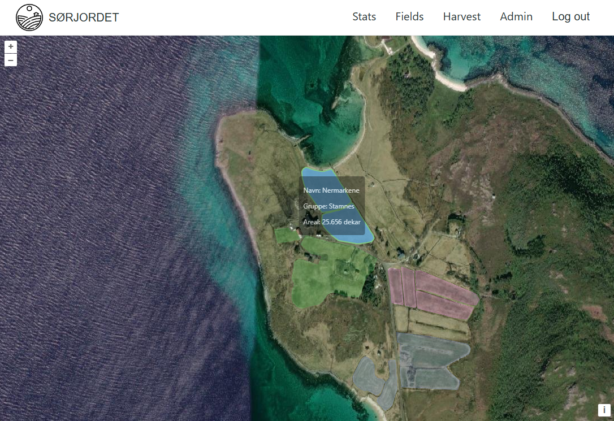
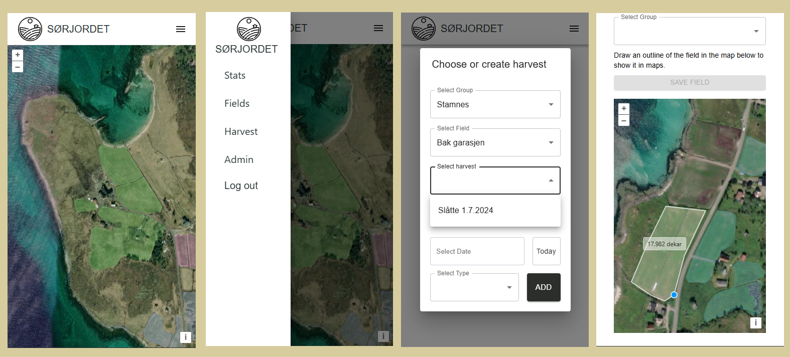

# Sørjordet
> https://sorjordet.fly.dev

Sorjordet is a web app for my family farm, where we can track harvest data in an interactive manner.
It allows us to plot the fields we harvest onto a map, and group the fields by area. 
We can register harvests per field, and use this data to gain useful insights.

The frontend is built in Typescript with Solid.js, and OpenLayers for maps. 
The backend is built in Rust, using the Axum framework and various other supporting libraries. 
The backend implements user authentication with argon2 password hashing and JWT tokens.

