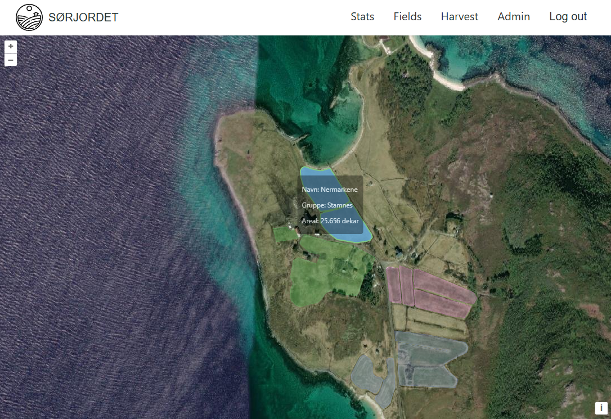
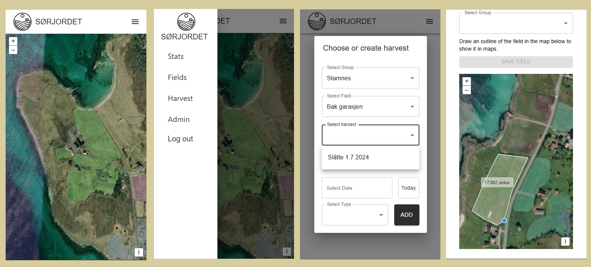

# Sørjordet
> https://sorjordet.fly.dev

Sorjordet is a web app for my family farm, where we can track harvest data in an interactive manner.
It allows us to plot the fields we harvest onto a map, and group the fields by area. 
We can register harvests per field, and use this data to gain useful insights.


The frontend is built in Typescript with Solid.js, and OpenLayers for maps. 
The backend is built in Rust, using the Axum framework and various other supporting libraries. 
The backend implements user authentication with argon2 password hashing and JWT tokens.


## Local development database

Start Postgres with migrations and dummy data:

```sh
docker compose up -d postgres
```

The compose service initializes a fresh `sorjordet` database from `migrations/` and then runs `scripts/seed-dev.sql`. To seed an existing local database again, run:

```sh
scripts/seed-dev-db.sh
```

Copy `.env.example` to `.env` for local server defaults. The seeded dev login is `dev` / `local-dev-password`, and it expects `PW_SECRET=local-dev-password-secret`.



