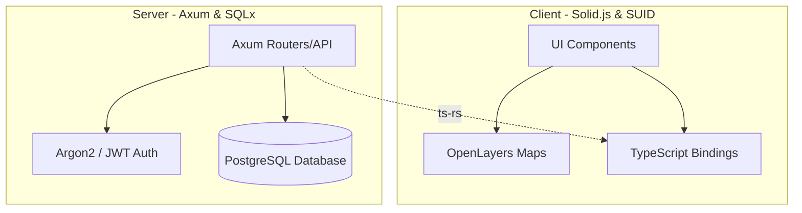

# 🤖 AI Agent Developer Guidelines (agents.md)

Welcome, AI Agent! This file serves as a standardized guide and "README for machines" to help you understand the architecture, code patterns, development workflows, and constraints of the **Sørjordet** repository.

---

## 🌾 Project Overview

**Sørjordet** is an interactive web application designed for a family farm to track and manage harvest data. 
- **Core Purpose**: Plot harvest fields on a map, group fields by area, register and analyze harvests, and derive operational insights.
- **Production URL**: [https://sorjordet.fly.dev](https://sorjordet.fly.dev)

---

## 🛠️ Technology Stack & Architecture

The codebase is split into a **Rust Backend** and a **TypeScript Frontend**:

### 1. Backend (`./Server`)
- **Language/Framework**: Rust, Axum
- **Database Access**: SQLx (with PostgreSQL)
- **Authentication**: JWT tokens & Argon2 password hashing
- **TypeScript Bindings**: Generated automatically using `ts-rs` annotations on Rust structs.

### 2. Frontend (`./Client`)
- **Language/Framework**: TypeScript with Solid.js
- **UI Components**: SUID (Material UI port for Solid.js)
- **Map & Spatial Features**: OpenLayers (`ol` and `ol-ext` library)
- **State & Data Fetching**: TanStack Solid Query (`@tanstack/solid-query`)

---

## 🚀 Common Development Scripts

Always invoke commands from their respective directories or set the correct `Cwd` (Current Working Directory).

### Backend Commands
From `./Server`:
*   **Run Development Server**: `cargo run`
*   **Run Tests & Generate Bindings**: `cargo test`
*   **Database Migrations**: `sqlx migrate run`

### Frontend Commands
From `./Client`:
*   **Install Dependencies**: `pnpm install` (or `npm install`)
*   **Run Development Server**: `npm run dev`
*   **Production Build**: `npm run build`
*   **Formatting**: `npm run format` (Prettier)
*   **Linting**: `npm run lint` (ESLint)

### The API Type Synchronizer
At root `./`:
*   **Sync TypeScript Bindings**: `./generate_ts_bindings.sh`
    > [!IMPORTANT]
    > This shell script runs backend tests to compile Rust models with `#[derive(TS)]` and outputs fresh TypeScript interface definitions directly into `./Client/bindings/`.

---

## ⚠️ Critical AI Constraints & Guidelines

To ensure code health and consistency, you **MUST** adhere to the following rules:

### 1. TypeScript Bindings Ownership
*   **DO NOT** manually modify any files inside `Client/bindings/`.
*   If you need to change an API request/response shape, update the corresponding Rust struct in `Server/src/` (ensuring it derives `ts_rs::TS`), and then run the `./generate_ts_bindings.sh` script to auto-generate the updated TypeScript interfaces.

### 2. Styling & UX Design Excellence
*   **Avoid Plain / Generic Styling**: Do not use raw web-safe colors (e.g., standard red, blue) or raw unstyled components.
*   **Aesthetics Priority**: Use curated harmonious color palettes (HSL-tailored colors, high-end dark mode aesthetics, smooth glassmorphism).
*   **UI Library**: Always prefer using **SUID** (`@suid/material`) components and system styles instead of building raw HTML elements from scratch.
*   **Transitions & Micro-Animations**: Implement subtle hover interactions, active states, and transition animations to keep the interface feeling premium and responsive.
*   **No Placeholders**: Never write placeholder code or use placeholder image links. If an asset is needed, generate it or write full mock code.

### 3. Command Execution Constraints (Antigravity Specific)
*   **NEVER propose raw `cd` commands** inside shell command strings.
*   Instead, leverage the `Cwd` execution parameter in the command runner tool to specify the active directory directly.

### 4. Database Safety
*   Avoid raw SQL writes that bypass safety mechanisms. Use SQLx compile-time checked queries (`query!`, `query_as!`) whenever possible.
*   Document any schema migrations clearly inside `./migrations`.

### 5. Security & Privacy
*   **Never hardcode secrets** (like `JWT_SECRET` or database connection strings) in the source code.
*   Ensure `.env` files are in `.gitignore` and variables are read dynamically via standard environment helpers.

---

## 🧠 Available AI Collaboration Tools

You have access to the following built-in environment capabilities:
- **Slash Commands**:
  - `/goal`: Launch long-running autonomous development sequences.
  - `/schedule`: Set up recurring cron jobs or one-off timers.
  - `/browser`: Open browser instrumentation for UI preview and debugging.
  - `/grill-me`: Engage the developer in an interactive interview to align on design plans.
- **Subagents**:
  - `research`: Read-only assistant ideal for large-scale code searching or technical documentation lookup.
  - `self`: Direct clone of yourself for parallel code execution contexts.
